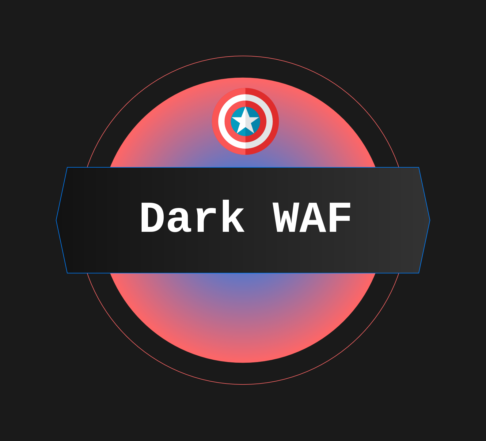

# DarkWAF (ExpressJS Security Gateway)

<div align="center">
  
</div>


## Overview
DarkWAF is a multi-layered Web Application Firewall (WAF) and Reverse Proxy built on ExpressJS. It is designed to act as a secure edge gateway for backend infrastructure, providing deep packet inspection, anomaly-based threat scoring, multi-layer payload decoding, behavioral fingerprinting, rate limiting, and dynamic IP blacklisting.

## Features

#### Anomaly Scoring Engine
Mitigates false positives by evaluating requests holistically. Each matched signature contributes a weighted threat score, and requests are only blocked if the total anomaly score meets or exceeds the configured threshold. Requests that partially match (warn-level score) are logged but allowed through, enabling tuning without impacting legitimate traffic.

#### Multi-Layer Payload Decoding
Before signatures are evaluated, incoming payload strings are passed through a normalisation pipeline to defeat obfuscation attempts:
1. **Iterative URL Decoding** — Decodes URL-encoded payloads up to 3 times to catch double and triple encoding attacks (e.g. `%253Cscript%253E` → `%3Cscript%3E` → `<script>`)
2. **Base64 Detection & Decoding** — Detects structurally valid base64 strings (minimum 16 characters, properly padded) and decodes them for inspection. Only decoded strings that contain entirely printable ASCII characters are scanned, preventing binary false positives.

#### Deep Packet Inspection (DPI)
Scans all incoming HTTP request surfaces including JSON bodies (both keys and values, recursively), URL query parameters, URL paths, and HTTP headers (User-Agent, Cookie, Referer, X-Forwarded-For, etc.). The inspection engine uses a hybrid detection approach:

- **Native LibInjection (C++)** — SQL Injection is detected using [`node-libinjection`](https://github.com/ntedgi/node-libinjection), a native Node.js binding to the `libinjection` C library — the same engine that powers ModSecurity, NGINX ModSec, and Cloudflare's WAF. Decoded payloads (URL and Base64) are passed through LibInjection to catch encoded SQLi attacks.
- **Regex Signature Engine** — All other attack categories are detected using a set of handcrafted, performance-tuned regular expressions.

Active signatures (14 rules):

| ID | Signature | Score |
|----|-----------|-------|
| — | SQL Injection (LibInjection — native C++) | 5 |
| 1 | Cross-Site Scripting (XSS) | 5 |
| 2 | Path Traversal / LFI | 5 |
| 3 | OS Command Injection | 5 |
| 4 | NoSQL Injection | 5 |
| 5 | Server-Side Template Injection (SSTI) | 5 |
| 6 | SSRF — Protocol Detection (`gopher://`, `file://`, etc.) | 3 |
| 7 | SSRF — Internal IP Detection (`127.0.0.1`, `169.254.169.254`, RFC1918) | 5 |
| 8 | XML External Entity (XXE) | 5 |
| 9 | LDAP Injection | 5 |
| 10 | Mail Header Injection | 5 |
| 11 | Server-Side Includes (SSI) | 5 |
| 12 | CRLF Injection | 5 |
| 13 | XML Injection | 4 |

#### Signature Deduplication
Each signature can only contribute its anomaly score **once per request**, regardless of how many times it matches across fields. This prevents a single attack type from artificially inflating the score (e.g. an array of 100 URLs should not score 300 points for SSRF).

#### Behavioral Fingerprinting
Detects automated scanners, bots, and penetration testing tools by analyzing HTTP header metadata that legitimate browsers send but automated tools typically omit or fake. Fingerprint scores are added to the anomaly score, acting as a force multiplier that tips borderline payloads over the block threshold without blocking legitimate tools on their own.

| Check | Score | Rationale |
|-------|-------|-----------|
| Known scanner UA (`sqlmap`, `nikto`, `nuclei`, etc.) | +5 | Literal attack tools — instant block |
| Bot library UA (`curl/`, `python-requests`, etc.) | +1 | Suspicious but not malicious |
| Empty User-Agent | +2 | Unusual for legitimate clients |
| All `Sec-Fetch-*` headers missing | +1 | Not a real browser |
| Missing `Accept-Language` | +1 | Mild anomaly signal |
| UA claims browser but generic `Accept: */*` | +1 | Inconsistent fingerprint |

#### Rate Limiting
Sliding-window rate limiter that tracks request timestamps per IP in memory. Requests exceeding the configured limit receive an `HTTP 429 Too Many Requests` response with a `Retry-After` header. Rate limiting runs before signature matching to save CPU on abusive IPs.

- Default: **100 requests per 60 seconds** per IP
- Configurable via `RATE_LIMIT_MAX` and `RATE_LIMIT_WINDOW_MS` environment variables
- Automatic cleanup of expired entries to prevent memory leaks

#### Dynamic IP Blacklisting
Automatic ban system that permanently (or temporarily) blocks IPs that repeatedly trigger WAF blocks. Every time the signature engine returns a `403`, a strike is recorded against that IP. After a configurable number of strikes within a time window, the IP is banned and all subsequent requests are instantly rejected with zero processing.

- Default: **5 strikes within 5 minutes** triggers a **30-minute ban**
- Configurable via `BLACKLIST_MAX_STRIKES`, `BLACKLIST_STRIKE_WINDOW`, and `BLACKLIST_BAN_DURATION` environment variables
- Bans expire automatically via TTL, preventing permanent lockout of shared IPs (e.g. corporate NATs)
- Cleanup of expired bans and stale strikes runs every 60 seconds

#### Reverse Proxy Routing
Invisible traffic forwarding to internal upstream applications, ensuring clients only communicate with the edge WAF. Backend services remain completely isolated from direct internet exposure. The upstream target is configurable via the `UPSTREAM_TARGET` environment variable.

---

#### SIEM Integration
Structured JSON event logging via Winston, designed for real-time ingestion into enterprise SIEM platforms (Splunk, ELK/Elasticsearch, Grafana Loki, etc.).

| Transport | Format | Contents |
|-----------|--------|----------|
| Console | Colored, human-readable | All events (development) |
| `logs/darkwaf-events.log` | JSON Lines | All events (SIEM ingestion) |
| `logs/darkwaf-blocked.log` | JSON Lines | Blocked events only (alerting) |

Each log entry includes structured metadata: timestamp, action, IP, HTTP method, path, User-Agent, anomaly score, and triggered rules. Log files auto-rotate at 10 MB with 5-file retention. Configurable via `LOG_LEVEL` and `LOG_DIR` environment variables.

---

## Architecture Highlights

### Request Pipeline
```
Request → Blacklist → Rate Limit → Signatures → Fingerprinting → Proxy
              ↑                         |
              |                         ↓
              └─── auto-ban ←── 5th strike (403)
```

- **Blacklist Check**: Simple Map lookup — zero CPU cost for banned IPs.
- **Rate Limiting**: Sliding-window timestamp check per IP.
- **Decoding Pipeline**: `Raw Input → URL Decode (×3) → Base64 Decode → Inspect`
- **Inspection Engine**: LibInjection (SQLi) + Regex signatures. Matched signatures are deduplicated by ID and their scores are accumulated alongside fingerprinting scores. If the total anomaly score meets the block threshold, the request is terminated with `403 Forbidden`.
- **Topology**: Adopts an edge gateway deployment model, sitting at the perimeter of the network to shield internal servers and microservices from direct internet exposure.

---

## Installation & Deployment

### Local Installation
```bash
# Install dependencies
npm install

# Start the WAF (proxying to a backend on localhost:5000)
UPSTREAM_TARGET=http://localhost:5000 node main.js
```

### Docker

Build the image:
```bash
docker build -t darkwaf .
```

Run the container:
```bash
docker run -p 3000:3000 \
  -e UPSTREAM_TARGET=http://192.168.1.10:5000 \
  darkwaf
```

> **Note:** `localhost` inside a Docker container refers to the container itself, not the host machine. Use the actual host IP or `--network=host` for development.

Using host networking (Linux development):
```bash
docker run --network=host \
  -e UPSTREAM_TARGET=http://localhost:5000 \
  darkwaf
```

### Environment Variables

| Variable | Default | Description |
|----------|---------|-------------|
| `UPSTREAM_TARGET` | `http://localhost:5000` | URL of the backend application to proxy traffic to |
| `PORT` | `3000` | Port the WAF listens on |
| `RATE_LIMIT_MAX` | `100` | Maximum requests per IP per window |
| `RATE_LIMIT_WINDOW_MS` | `60000` | Rate limit window in milliseconds |
| `BLACKLIST_MAX_STRIKES` | `5` | Blocks before an IP is auto-banned |
| `BLACKLIST_STRIKE_WINDOW` | `300000` | Strike counting window in milliseconds |
| `BLACKLIST_BAN_DURATION` | `1800000` | Ban duration in milliseconds |
| `LOG_LEVEL` | `info` | Minimum log level (`debug`, `info`, `warn`, `error`) |
| `LOG_DIR` | `logs` | Directory for SIEM log files |

**System Requirements:**
- Node.js v18+
- GCC / Clang (for compiling native LibInjection bindings)
